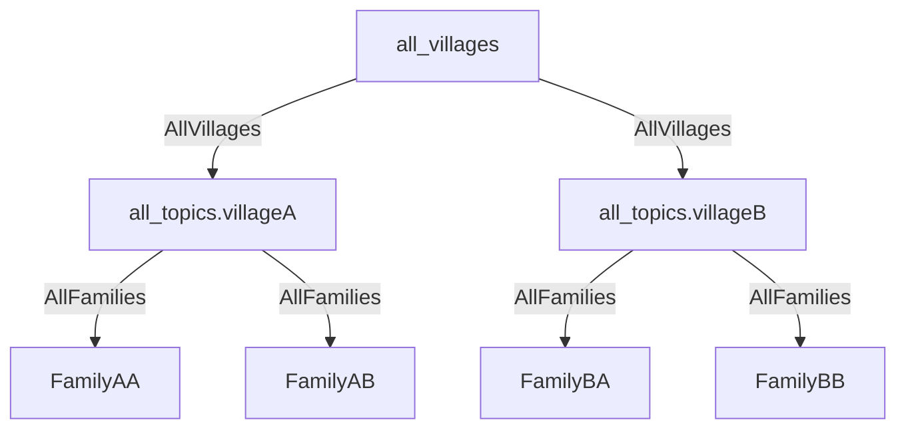

# Telefono-Casa Entities

## Entities Structure




### User Profile

```rust
The user profile is stored as the tag of links from the agents.

pub struct UserProfile {
    pub first_name: String,
    pub last_name: String,
    pub email_address: Option<String>
    pub about_me: Option<String>,
}
```

### House

```rust
#[hdk_entry_helper]
pub struct House {
    pub name: String,
    pub location: String, //dot notation
    pub members_size: u8,
    pub time_of_posting: Timestamp,
}
```

### HouseHolder

```rust
#[hdk_entry_helper]
pub struct HouseHolder {
    pub agent: AgentPubKey,
    pub house_hash: ActionHash
}
```

### Family

```rust
#[hdk_entry_helper]
pub struct Family {
    pub family_name: String,
    pub time_of_posting: Timestamp,
}

pub struct AddUserToFamily {
    pub agent: AgentPubKey,
    pub family_hash: ActionHash
}
pub struct RemoveUserFamily {
    pub agent: AgentPubKey,
    pub family_hash: ActionHash
}
```

### Village

```rust
#[hdk_entry_helper]
pub struct Village {
    pub name: String,
    pub description: Option<String>,
}
```
