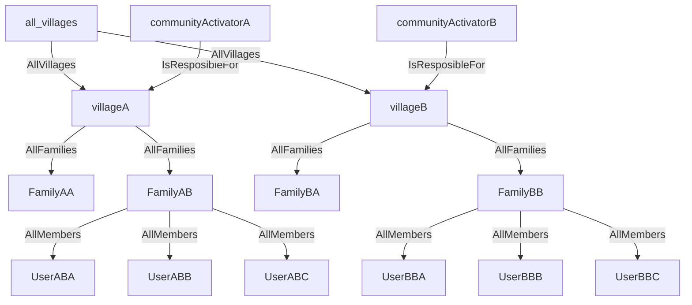
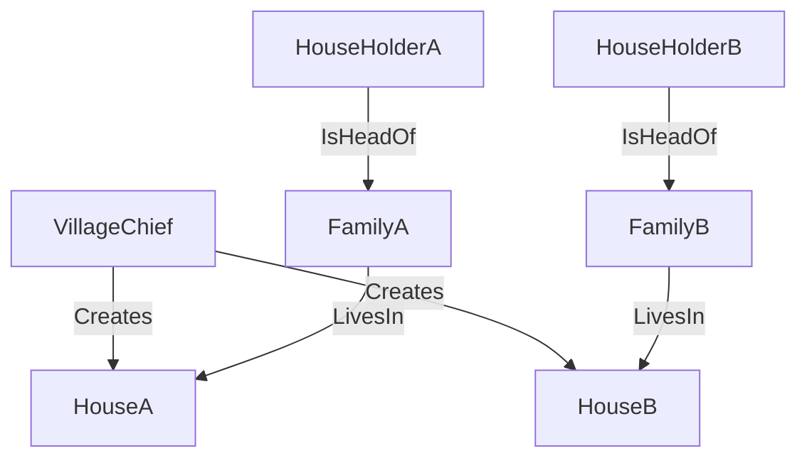

# Telefono-Casa Entities

## Entities Structure




    
### User Profile

The user profile is stored as a link tag that goes from/to the agent hash.

```rust
pub struct UserProfile {
    pub first_name: String,
    pub last_name: String,
    pub email_address: Option<String>
    pub about_me: Option<String>,
}
```

### House

Important properties of the House create action:
- author: Hash ===> this is the 'Village Chief'
- time_of_posting: Timestamp,

```rust
pub struct House {
    pub name: String,
    pub location: String, //dot notation
    pub members_size: u8,
}
```

### Family

Important properties of the Family create action:
- author: Hash ===> this is the 'HouseHolder'
- time_of_posting: Timestamp,

```rust
#[hdk_entry_helper]
pub struct Family {
    pub family_name: String,
    //TODO
}

pub struct AddUserToFamily {
    pub agent: AgentPubKey,
    pub family_hash: ActionHash
}
pub struct RemoveUserFromFamily {
    pub agent: AgentPubKey,
    pub family_hash: ActionHash
}
```

### Village

```rust
#[hdk_entry_helper]
pub struct Village {
    pub name: String,
    pub description: Option<String>,
}
```
